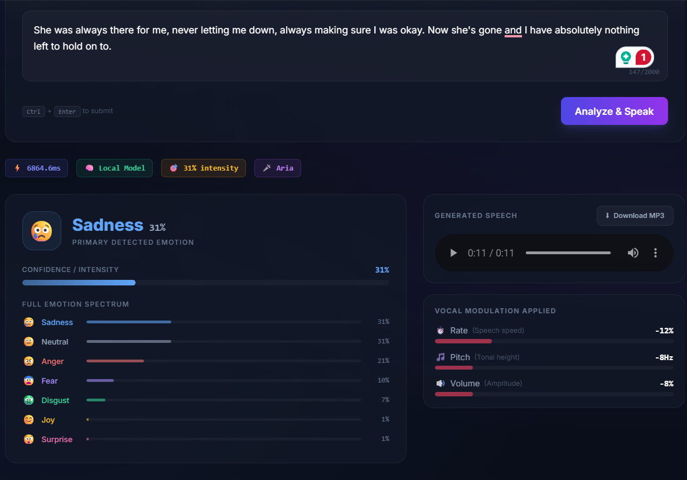
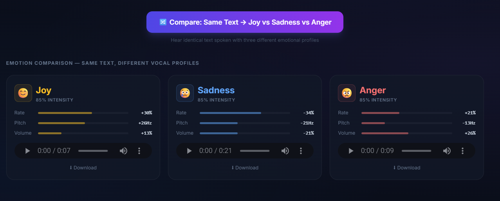
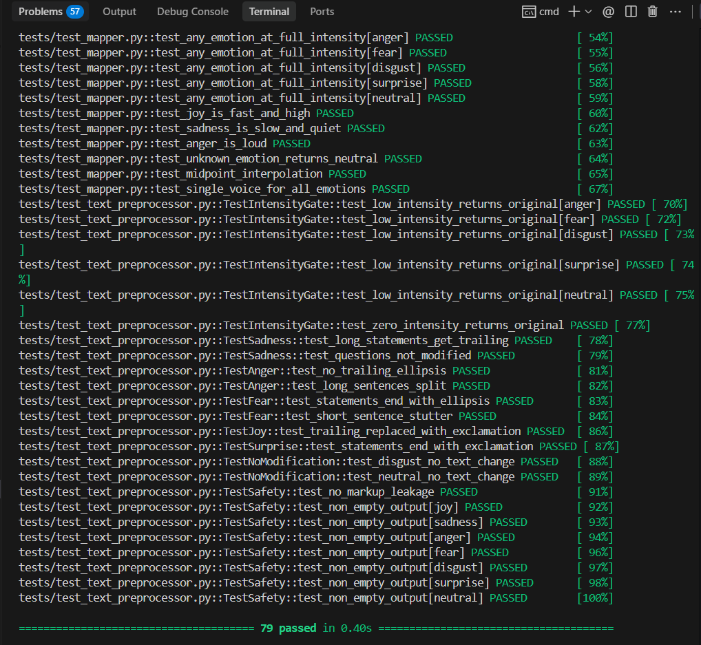

# The Empathy Engine

An emotion-aware text-to-speech service. Give it text, it figures out the emotion, then speaks it in a voice that actually matches — sad text sounds heavy and slow, angry text is loud and punchy, happy text is fast and bright. One voice, modulated entirely through rate, pitch, and volume.

---

## Project Overview

- Uses a **single voice** (Microsoft AriaNeural) for all emotions. No voice switching — the emotional range comes entirely from adjusting speech rate, pitch, and volume. Keeps it sounding like one person, not seven different speakers.

- Emotion detection runs locally through `j-hartmann/emotion-english-distilroberta-base` — classifies into 7 categories (joy, sadness, anger, fear, disgust, surprise, neutral). I added a **keyword-boosting layer** on top because the model kept tagging angry text as "neutral." It scans for words like "furious", "heartbroken", "terrified" and corrects the scores.

- **Intensity scaling is continuous.** "This is fine" at 30% joy gets a subtle rate bump. "THIS IS AMAZING" at 95% joy is fast, high-pitched, and loud. It's not just three buckets — every intensity level maps to different voice parameters through linear interpolation.

- The text gets **rewritten before synthesis** depending on the emotion. Angry text has its `...` stripped and long sentences chopped into short punchy ones. Sad text gets trailing ellipses and pauses. Fear gets stutters (`I... I can't`). Joy converts all `...` to `!`. The TTS engine responds to punctuation, so this actually changes how it sounds.

- **Sentence-by-sentence synthesis** with ±3-5% random variation in rate/pitch/volume per sentence. Without this, long paragraphs sound flat because every sentence has the exact same cadence.

- **Comparison mode** — same text, three emotions (joy, sadness, anger) played side by side. Fastest way to hear that the modulation is working.

- **SSML generation** — the UI has an "SSML Markup" tab showing the full `<speak>` document with per-sentence `<prosody>` tags, emotion-timed `<break>` pauses (600ms for sadness, 200ms for anger), and `<emphasis>` on stressed words.

---

## Screenshots

**Pipeline + Emotion Detection** — The top bar shows each processing step. Below: example prompts, text input, the detected emotion with confidence score, audio player, and processing metrics. In this case it detected Fear at 85% confidence.


-------------------------------------------------------------------------------------------
**Sadness Result** — Left side: confidence breakdown across all 7 emotions (sadness and neutral tied at 31%). Right side: the voice was slowed by 12%, pitch dropped 8Hz, volume dropped 8%. You can hear the difference.



-------------------------------------------------------------------------------------------

**Comparison Mode** — Same text spoken three ways. Joy is fast (+30% rate, +26Hz pitch), sadness is slow (-34% rate, -21Hz), anger is loud (+26% volume). Play all three back to back.



-------------------------------------------------------------------------------------------

**SSML Output** — The SSML markup tab shows what's actually being sent to the TTS engine. Each sentence has its own `<prosody>` tag, and there's a 393ms pause between them because the emotion is sadness.


-------------------------------------------------------------------------------------------

**79 Tests Passing** — Mapper, emotion detection, text preprocessor, and API integration tests all green.



-------------------------------------------------------------------------------------------

---

## How it works

```
Text
  → Emotion detection (HuggingFace 7-class model + keyword boosting)
  → Voice parameter mapping (rate/pitch/volume based on emotion + intensity)
  → Text enrichment (emotion-specific punctuation: pauses, stutters, exclamations)
  → SSML generation (per-sentence prosody tags, breaks, emphasis)
  → Edge-TTS neural synthesis (sentence by sentence, with slight variation each time)
  → MP3
```

**The key decisions:**

I use **one voice** (AriaNeural) for everything. Switching voices per emotion makes it sound like different people talking — that defeats the purpose. All the emotional range comes from modulating rate, pitch, and volume on the same voice.

**Intensity scaling** is continuous, not bucketed. The formula is just `param = neutral + intensity × (extreme - neutral)`. So "this is fine" (joy at 0.3) sounds slightly upbeat, while "THIS IS AMAZING" (joy at 0.95) sounds properly excited.

**The text preprocessor** rewrites input before synthesis. Anger strips out all `...` because angry people don't trail off — they hit hard. Sadness adds them. Fear adds stutters (`I... I can't`). Joy converts `...` to `!`. These punctuation changes affect how the TTS engine handles prosody.

**Keyword boosting** patches the ML model's mistakes. The HuggingFace model sometimes tags obviously angry text as "neutral." So after model inference, I scan for words like "furious," "ruined," "NEVER" and bump the anger score. Same for sadness ("heartbroken", "empty"), fear ("terrified"), etc. It's a simple post-processing step but it catches the cases the model misses.

**Sentence-by-sentence synthesis** with ±3-5% random variation in params. Without this, long paragraphs sound robotic because every sentence has the exact same cadence. Small random variation fixes that.

---

## Setup

```bash
git clone <your-repo-url>
cd empathy-engine

# Backend
python -m venv .venv
.venv\Scripts\activate          # Windows
pip install -r requirements.txt
uvicorn app.main:app --reload   # First run downloads ~330MB model

# Frontend (second terminal)
cd frontend
npm install
npm run dev
```

No API keys. Everything runs locally.

| | URL |
|---|---|
| Web UI | http://localhost:5173 |
| API docs | http://localhost:8000/docs |

**CLI** — works without the frontend:
```bash
python cli.py "I finally got into my dream university!"
python cli.py --emotion anger "This is a test sentence."
```

**Tests:**
```bash
pytest tests/ -v
```

---

## Voice parameters

At full intensity. Lower intensities interpolate toward zero.

| Emotion | Rate | Pitch | Volume | Reasoning |
|---------|------|-------|--------|-----------|
| Joy | +35% | +30Hz | +15% | High arousal, positive — fast and bright |
| Sadness | -40% | -25Hz | -25% | Low arousal — heavy, dragging, quiet |
| Anger | +25% | -15Hz | +30% | High arousal, negative — fast, deep, loud |
| Fear | +30% | +25Hz | -15% | High arousal — rushed, high-pitched, quiet |
| Surprise | +20% | +40Hz | +20% | Startled — pitch jumps up |
| Disgust | -25% | -18Hz | -10% | Low arousal — slow, flat, dismissive |
| Neutral | +0% | +0Hz | +0% | Baseline |

These are loosely based on the arousal-valence model from speech psychology. High-arousal emotions (anger, fear, joy) are faster. Low-arousal (sadness, disgust) are slower. Positive emotions tend to have higher pitch.

---

## Bonus objectives

All four from the assignment spec:

| | What | How |
|---|---|---|
| ✅ | Granular Emotions | 7 emotion classes via `j-hartmann/emotion-english-distilroberta-base`, not just positive/negative/neutral |
| ✅ | Intensity Scaling | Continuous linear interpolation, not thresholds |
| ✅ | Web Interface | React + FastAPI, includes comparison mode and audio download |
| ✅ | SSML Integration | Generates full `<speak>` documents with `<prosody>`, `<break>`, `<emphasis>` |

---

## Project structure

```
├── app/
│   ├── api/
│   │   ├── routes.py             # /analyze, /audio, /health endpoints
│   │   └── schemas.py            # Request/response models
│   ├── core/
│   │   ├── config.py             # Settings
│   │   ├── cache.py              # SHA-256 keyed result cache
│   │   └── local_model.py        # HuggingFace pipeline loader
│   ├── services/
│   │   ├── emotion.py            # Detection + keyword boosting
│   │   ├── mapper.py             # Emotion → voice params
│   │   ├── text_preprocessor.py  # Punctuation enrichment
│   │   ├── ssml_generator.py     # SSML markup
│   │   └── audio.py              # Edge-TTS synthesis
│   └── main.py
├── frontend/                     # React 18 + Vite + Tailwind
├── tests/                        # pytest (mapper, emotion, preprocessor, API)
├── cli.py                        # CLI interface
└── requirements.txt
```

## Stack

| | |
|---|---|
| Backend | FastAPI |
| Emotion model | `j-hartmann/emotion-english-distilroberta-base` (runs locally) |
| TTS | Edge-TTS (Microsoft neural voices, free, no API key) |
| Frontend | React 18 + Vite + Tailwind |
| Tests | pytest + pytest-asyncio |
